# 📊 ChurnLens: Telecom Customer Attrition Analysis

## 📌 Overview
Companies often use customer attrition analysis and customer attrition rates as one of their key business metrics (along with cash flow, EBITDA, etc.) because the cost of retaining an existing customer is far less than the cost of acquiring a new one.Hence, The process to analyze customer needs retention plays a significant part in improving the company's growth, protects loyal customers, and improve its customer relationship management (CRM). 
 As a data analyst, my job is to provide an in-depth analysis of  Telecom’s churn dataset and to answer the following questions

## 🔍 Key Questions Answered
✅ What is the overall churn rate?  
✅ Which services have the highest churn rate?  
✅ What is the revenue lost due to churn?  
✅ Does contract type affect churn rate?  
✅ How do customer demographics impact churn?

## 📂 Dataset
The dataset contains customer information, service usage, and churn status.

- **Total Customers:** `7043`
- **Key Features:** Customer tenure, monthly charges, demographics, location, internet/phone services, additional services (e.g., security, backup), and churn status.
- **Data Sources:** https://community.ibm.com/community/user/businessanalytics/blogs/steven-macko/2019/07/11/telco-customer-churn-1113.


## 🛠️ Tools Used
- **Database:**  MySQL
- **Query Language:** SQL
 &nbsp;

### **1️⃣ Database Setup**
- Created the **`telecom_customer`** database.
- Designed multiple **normalized tables**:
  - **`demographics`** → Customer details (age, gender, dependents).
  - **`location`** → Customer location details.
  - **`population`** → Population data linked via zip codes.
  - **`status`** → Customer churn status and scores.
  - **`services`** → Services subscribed, contract types, and financial details.

```sql
CREATE DATABASE telecom_customer;
USE telecom_customer;
```

---

### **2️⃣ Data Import & Verification**
- Imported data into tables.
- Ran `SELECT` queries to verify successful imports.
- Checked for **duplicate records** to ensure data integrity.

```sql
SELECT Customer_ID, COUNT(*) AS duplicate_check
FROM demographics 
GROUP BY Customer_ID
HAVING duplicate_check > 1;
```

✅ **Outcome:** No duplicate records were found.

---

### **3️⃣ Data Cleaning & Preprocessing**
- **Checked for NULL values** in each table.
- **Verified referential integrity** between tables.
- **Dropped unnecessary columns** (e.g., redundant `count` columns).

```sql
ALTER TABLE demographics DROP COLUMN count;
```

✅ **Outcome:** Clean, structured dataset with accurate relationships.

---

### **4️⃣ Establishing Relationships (Foreign Keys)**
- Defined **Foreign Key Constraints** to link tables and ensure **data consistency**.
- Connected `Customer_ID` across multiple tables and `Zip_Code` for location validation.

```sql
ALTER TABLE telecom_customer.demographics
ADD CONSTRAINT fk_demo_service_CustId
FOREIGN KEY (Customer_ID) REFERENCES telecom_customer.services(Customer_ID);
```

✅ **Outcome:** All tables correctly linked, preventing orphan records.

---
## 📌 Ad-hoc Business Questions & SQL Queries
Here are some **ad-hoc** business questions answered using SQL:
### 📊 General Customer Insights

🔹 **Total Number of Customers** – Find the total number of unique customers. 

 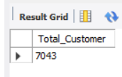 &nbsp;
 
🔹 **Typical Tenure for Churned Customers** – Analyze tenure distribution among churners.

 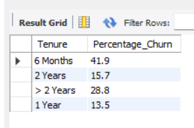 &nbsp;
 
🔹 **Age Group with Higher Churn Rates** – Identify which age category experiences the highest churn.  

 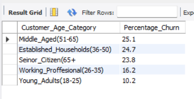 &nbsp;
 
### 💰 Revenue & Financial Impact

🔹 **Revenue Lost Due to Churn** – Calculate the percentage of total revenue lost to churned customers.  

 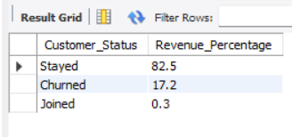 &nbsp;
 
### 📄 Churn Breakdown & Reasons

🔹 **Churn Breakdown by Contract Type** – Analyze the churn rate for different contract durations.

 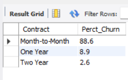 &nbsp;
 
🔹 **Top 3 Reasons for Customer Churn** – Identify the most common reasons for customer attrition.  

 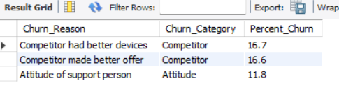 &nbsp;
 
### 🌍 Location & Demographics

🔹 **Cities with the Highest Churn Rates** – Find which cities have the most churners.  

 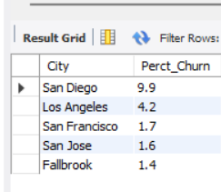 &nbsp;
 
🔹 **Are Churners Married?** – Investigate the marital status of churned customers.  

 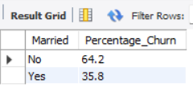 &nbsp;
 
🔹 **Did Churners Have Dependents?** – Analyze how family status affects churn likelihood.  

  &nbsp;
 
### 📡 Services & Offers Impact on Churn

🔹 **Offers Availed by Churned Customers** – Identify offers used by churned customers.  

  &nbsp;
 
🔹 **Customer Tenure Based on Last Marketing Offer Accepted** – Compare tenure differences by offers. 

 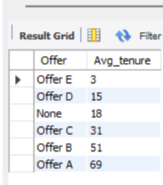 &nbsp;
 
🔹 **Internet Type Used by Churners** – Determine which internet service types had the most churn.  

 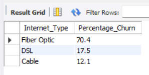 &nbsp;
 
🔹 **Internet Type Among 'Competitor' Churners** – Analyze internet types used by customers lost to competitors. 

 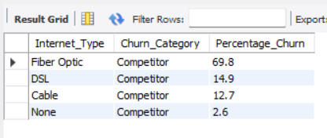 &nbsp;
 
🔹 **Most Common Additional Services Opted by Churned Customers** – Identify additional services frequently used by churners.  

 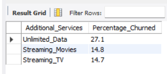 &nbsp;
 
### 📉 Customer Behavior & Risk Analysis

🔹 **Average Churn Score & High-Risk Customers** – Calculate average churn scores and identify high-risk segments.  

 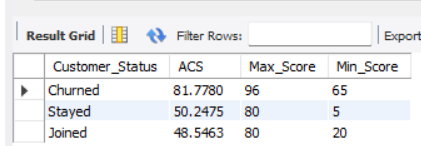 &nbsp;
 
🔹 **Correlation Between Satisfaction Score & Churn Rate** – Determine if customer satisfaction impacts churn.  

 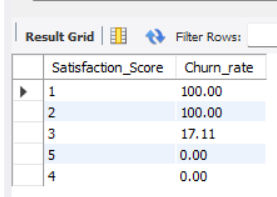 &nbsp;
 
🔹 **Did Churners Refer a Friend?** – Analyze if referred customers have a lower churn rate.  

 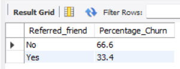 &nbsp;
 
## 📊 Insights & Findings
# Churned Customer Profile 📊  

## 1. Demographics  
- **Age:** 50+ (50% of churned customers fall in this category)  
- **Marital Status:** Most likely **single** (64% churned customers)  
- **Dependents:** **No dependents** (94%)  

## 2. Subscription & Service Details  
- **Contract Type:** **Month-to-month contracts** (89% of churners)  
- **Internet Service Type:** **Fiber optic** (70.4% churners), suggesting high expectations for speed and quality  
- **Streaming & Data Usage:** Heavy users (56.6% churners had unlimited data and streaming services)  

## 3. Behavioral & Satisfaction Factors  
- **Churn Score:** **Above 60** (Highly likely to churn)  
- **Satisfaction Score:** **Below 3 (100% churn rate)**  
- **Referral Activity:** **66.6% did not refer service to friends**, indicating dissatisfaction  

## 4. Geographical Trends  
- **Location:** Most churners are from **San Diego & Los Angeles**  

## 5. Promotional & Offer Response  
- **Promotions Impact:**  
  - **79% had no promotional offer or were on Offer E**  
  - **Customers on Offer E churn within an average of 3 months**  

## 6. Main Reasons for Churn  
- 🚀 **Better competitor offers** with superior pricing & service quality  
- 😠 **Poor customer support experience**  
- ⏳ **Lack of long-term contracts leading to easier cancellations**  

## 🎯 Key Takeaway  
The typical churned customer is a **single, 50+ individual with no dependents**, using **fiber optic services on a month-to-month contract**. They are dissatisfied due to **customer support issues and better competitor offers**, leading them to **leave within 3-6 months**.  

### 📌 **Retention Strategies**  
✅ Improve **customer support** experience  
✅ Offer **loyalty rewards & better pricing**  
✅ Promote **long-term contracts** with benefits  
✅ Target **high-churn locations (San Diego & Los Angeles)**  

---
🚀 **Use this profile to develop data-driven retention strategies and reduce churn!**  

## 🤝 Contributing
Feel free to contribute by improving queries, adding visualizations, or suggesting new analysis!

## 📩 Contact
📧 **Ritik Bhoyar**   
🔗 **[GitHub Profile](https://github.com/Ritikrb126)**  

---
## 📌 SQL Query Examples
```sql
-- Overall Churn Rate
SELECT ROUND((COUNT(CASE WHEN Customer_Status = 'Churned' THEN Customer_ID END) * 100.0) / COUNT(Customer_ID), 2) AS Churn_Rate
FROM status;

